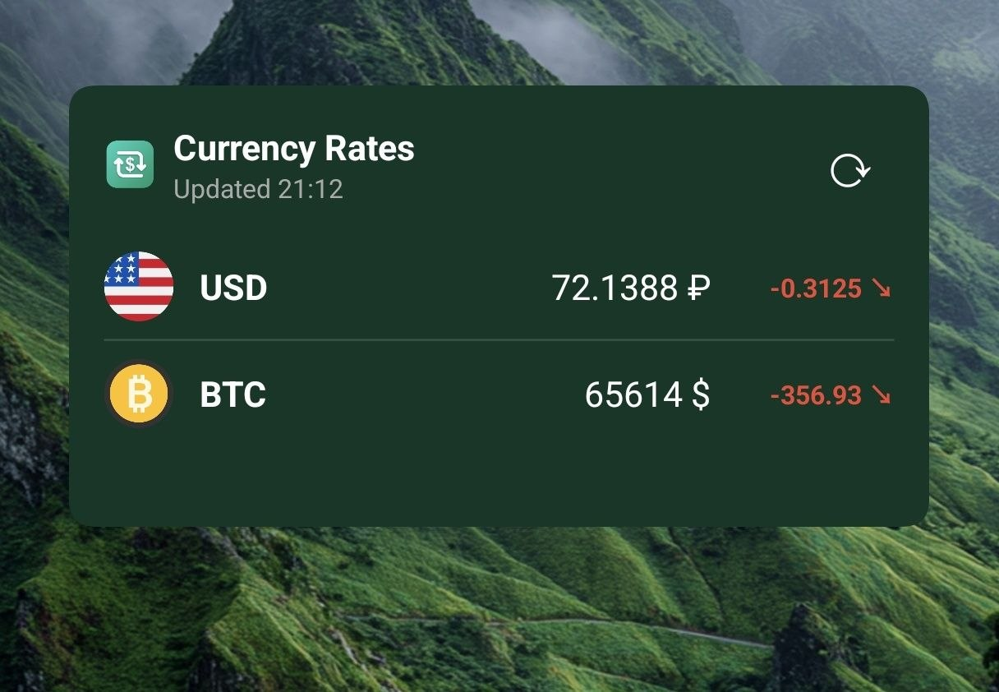

# CurrencyRate 💱

A modern, customizable Flutter application that provides a home screen widget for tracking currency exchange rates. Built with Material 3 and Dynamic Colors to perfectly blend with your device's theme.

<div align="center">
  
</div>

## Features ✨

* **Home Screen Widget**: Track your favorite currency pairs directly from your home screen.
* **Background Updates**: Automatically fetches the latest exchange rates in the background via Workmanager.
* **Material 3 Design**: Supports dynamic theming (Material You) on Android 12+, adapting to your wallpaper colors.
* **Custom Widget Themes**: Choose between System (Material You), Dark, Light, or fully Custom colors for your widgets.
* **Localization**: Fully localized in English and Russian.
* **Offline Support**: Caches previous exchange rates for offline viewing.

## Tech Stack 🛠️

* **[Flutter](https://flutter.dev/)**: Cross-platform UI toolkit.
* **[Home Widget](https://pub.dev/packages/home_widget)**: Used to create and update the native home screen widgets for iOS and Android.
* **[Workmanager](https://pub.dev/packages/workmanager)**: Handles background execution for fetching rates when the app is closed.
* **[Dynamic Color](https://pub.dev/packages/dynamic_color)**: Extracts colors from the OS for Material You theming.
* **[Shared Preferences](https://pub.dev/packages/shared_preferences)**: Stores local configuration and cached rates.

## Getting Started 🚀

### Prerequisites
* Flutter SDK (`^3.12.0`)
* Android Studio / Xcode

### Installation
1. Clone the repository:
   ```bash
   git clone <repository_url>
   ```
2. Navigate to the project directory:
   ```bash
   cd currency_widget
   ```
3. Install dependencies:
   ```bash
   flutter pub get
   ```
4. Run the app:
   ```bash
   flutter run
   ```

## Architecture 🏗️

The project follows a clean architecture approach, separating UI components from business logic and data repositories.

---

*Made with ❤️ using Flutter.*
